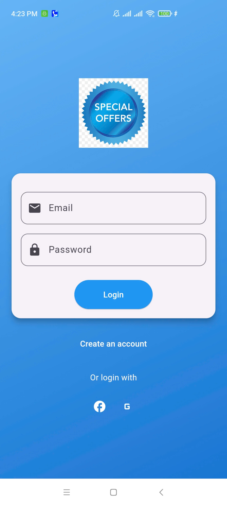
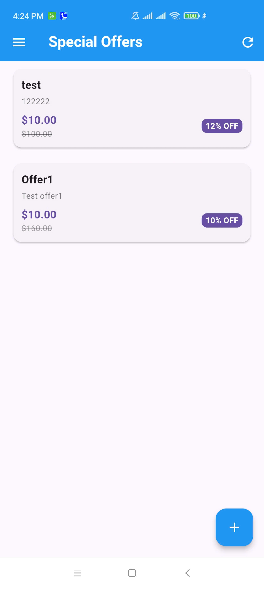
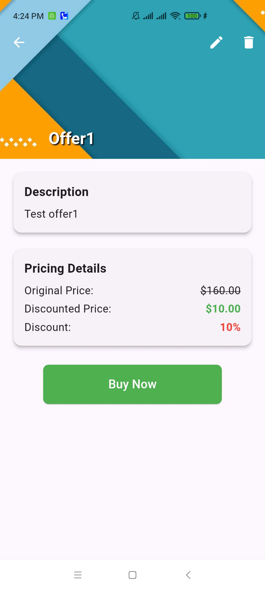
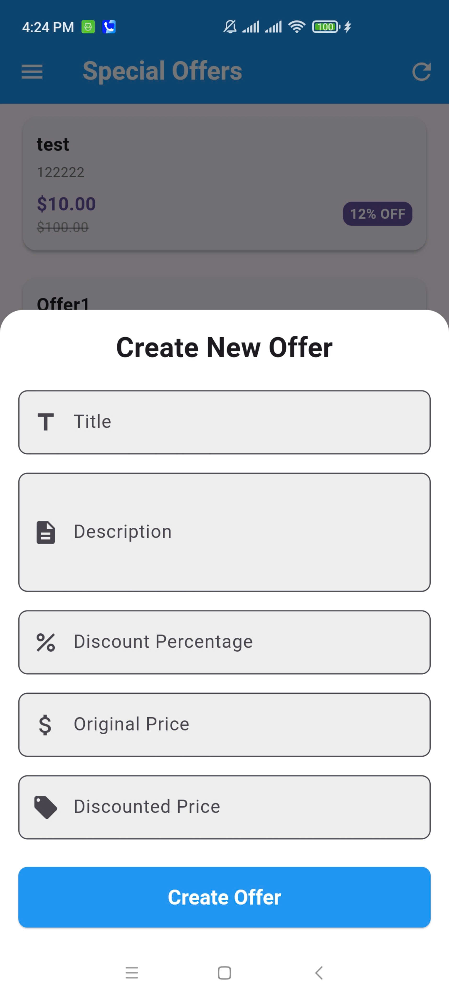
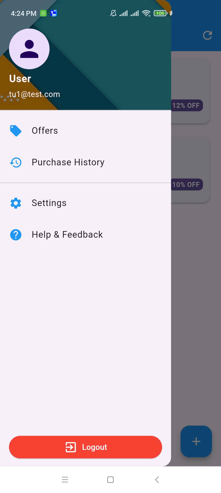
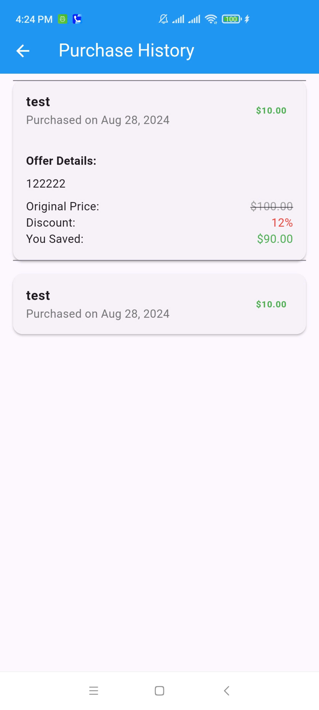
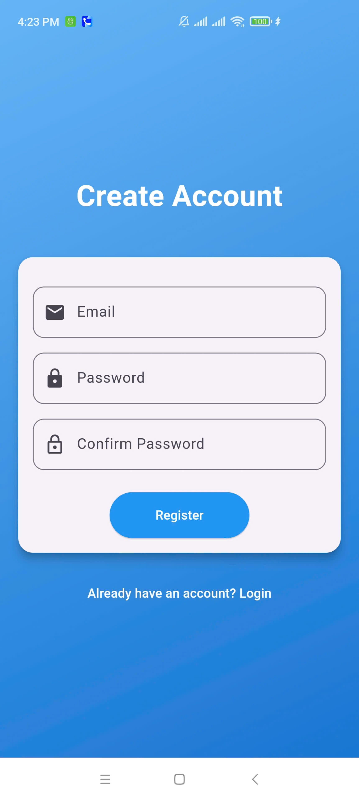

# Offer Listing Mobile App

This project is a lightweight application that demonstrates full-stack development skills, including frontend and backend development, database management, and API integration.

## Screenshots

Here are some screenshots of the application:

| Login Screen | Offer List | Offer Details | Create Offer | Menu | Purchase History | Create Account |
|--------------|------------|---------------| --------------|------|------------------| --------------- |
|  |  |  |  |  |  |  |

## Architecture

The project follows a clean architecture approach and consists of three main components:

1. Mobile App (Flutter)
   - Uses clean architecture with layers: presentation, domain, and data
   - Implements BLoC pattern for state management

2. Web Frontend (Flutter Web)
   - Shares codebase with the mobile app
   - Served via Nginx in Docker

3. Backend (Express.js with MongoDB)
   - RESTful API for offer management
   - MongoDB for data storage

## Setup Instructions

### Prerequisites

- Docker and Docker Compose
- Flutter SDK (for local mobile app development)

### Running the Application

1. Clone the repository:
   ```
   git clone https://github.com/nguyenhuutukhtn/offer_list_clean_architecture.git
   cd offer_list_clean_architecture
   ```

2. Start the entire application stack using Docker Compose:
   ```
   docker-compose up --build
   ```

3. Access the application:
   - Web Frontend: Open `http://localhost:8080` in your browser
   - Backend API: Available at `http://localhost:3000`

4. To run the Flutter mobile app for local development:
   ```
   cd mobile_app
   flutter run --dart-define=API_URL=http://localhost:3000
   ```

## Testing

- Backend: Run `npm test` in the `backend` directory
- Mobile/Web App: Run `flutter test` in the `mobile_app` directory

## Assumptions and Limitations

- The web frontend and mobile app share the same codebase
- The backend uses a simple authentication mechanism with Firebase
- The project is designed for local development and demonstration purposes
- Docker setup is optimized for development, not production deployment

## Future Improvements

- Implement more comprehensive error handling and input validation
- Add caching mechanisms for better performance
- Implement pagination for the offer listing
- Add push notifications for new offers
- Enhance the UI/UX design
- Implement more advanced authentication and authorization mechanisms
- Optimize Docker setup for production deployment
